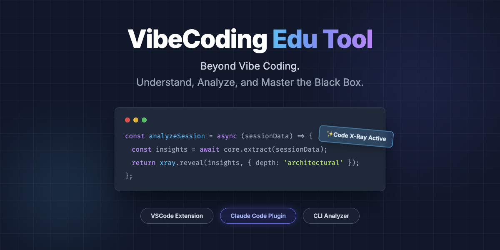
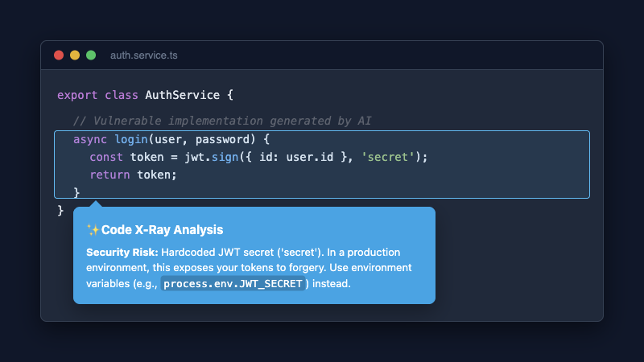
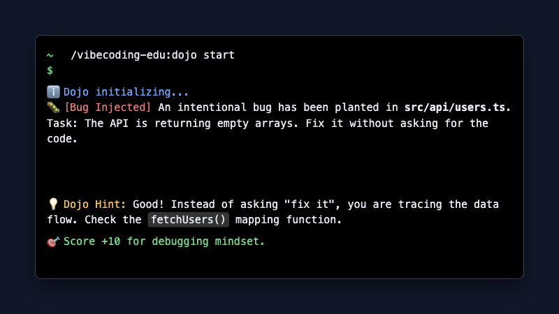
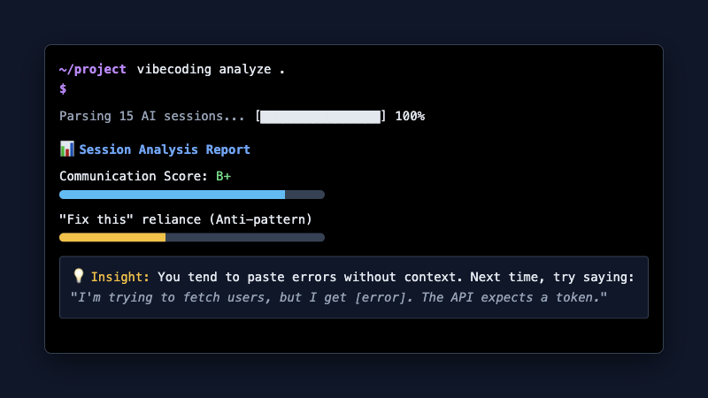

<div align="center">



# 🚀 VibeCoding Edu Tool

**Beyond Vibe Coding: The Power to Understand and Control AI-Generated Code**<br>
A tool that dismantles the "black box" of AI-generated code and helps you analyze and learn from a traditional software engineering perspective.

[English](README.md) | [한국어](README.ko.md)

[](https://github.com/woogwangsim/vibecoding_edu_tool_for_child/tree/main/packages/vscode-extension)
[](https://github.com/woogwangsim/vibecoding_edu_tool_for_child/tree/main/packages/claude-code-plugin)
[](https://www.gnu.org/licenses/agpl-3.0)

</div>

---

## 💡 Vibe Coding: Convenient, but are you anxious?

Recently, "Vibe Coding"—coding entirely through prompts using AI—has become a massive trend. Non-developers can easily build products, and developers can maximize their productivity.

However, there is a critical downside:
* **Non-Developers:** *"It works the way I want, but I have no idea how the code runs. What if it breaks later?"*
* **Developers:** *"It takes too much time and energy to review whether the AI-generated code adheres to our project conventions or traditional architectural principles."*

**VibeCoding Edu Tool** bridges this gap. It analyzes the code the AI wrote (Analyze), explains it in depth (X-Ray), and provides training to handle unexpected bugs (Dojo).

## ✨ Core Features

### 1. 🔍 Code X-Ray
We dissect the core logic of AI-generated code line by line. Going beyond simple comments, it explains *why* the code was written this way from a traditional software engineering perspective (architecture, performance, security). Non-developers can understand the underlying principles, and developers can significantly reduce code review time.



### 2. 🥋 Debugging Dojo
"An error occurred in the AI's code!" We intentionally inject bugs into actual project code and provide exercises to solve them. You will train your "prompting skills" (how to ask the AI accurately based on error messages) and develop a "sense for tracking down problems."



### 3. 📊 AI Session Analyzer
Statically analyzes your conversation history (Sessions) with AI agents like Claude Code or Codex CLI. It generates reports on which prompt patterns were effective and where the AI repeatedly makes mistakes, taking your underlying Vibe Coding skills to the next level.



---

## 🚀 Quick Start

Choose the tool that best fits your environment.

### 🛠 Track A: Claude Code Plugin (Fastest)
If you are a Claude Code user, you can use the features immediately as a plugin.

```bash
# Run local installation script
git clone https://github.com/woogwangsim/vibecoding_edu_tool_for_child.git
cd vibecoding_edu_tool_for_child
bash packages/claude-code-plugin/install.sh
```
> Available skills in Claude Code after installation:
> - `/vibecoding-edu:xray` : Analyze current code
> - `/vibecoding-edu:dojo` : Start debugging training
> - `/vibecoding-edu:analyze` : Analyze AI session history

### 💻 Track B: VSCode Extension (UI-based)
Recommended if you want visual analysis results while looking directly at the code.
1. Run `pnpm install && pnpm --filter ./packages/vscode-extension build && pnpm --filter ./packages/vscode-extension package`
2. Install the generated `.vsix` file in VSCode
3. Execute `Cmd + Shift + P` ➔ `VibeCoding: Start Analysis`

### 🧰 Track C: CLI Analyzer (Standalone Terminal)
Use this when you want to quickly analyze AI session history in CI/CD pipelines or local environments.
```bash
pnpm install
pnpm --filter ./packages/cli-analyzer build

# Analyze AI sessions in the current project
node packages/cli-analyzer/dist/cli.js analyze .
```

---

## 📦 Supported AI Tools

Currently, we support the local session files of the following tools for analyzing conversation history:
- **Claude Code** (`~/.claude/projects/`)
- **Codex CLI** (`~/.codex/sessions/`)

---

## 👨‍💻 Contributing

This project is built as a Monorepo (pnpm). Bug reports, feature suggestions, and PRs are all welcome!

<details>
<summary><b>Local Development Setup (Click to expand)</b></summary>

### Prerequisites
- Node.js 18+
- pnpm

### Build Instructions
```bash
git clone https://github.com/woogwangsim/vibecoding_edu_tool_for_child.git
cd vibecoding_edu_tool_for_child
pnpm install
pnpm build   # Build all packages simultaneously
```

### Repository Structure
- `packages/core`: Core session parsers and static analysis engine
- `packages/cli-analyzer`: CLI tool (`vibecoding analyze`)
- `packages/vscode-extension`: VSCode extension (using esbuild)
- `packages/claude-code-plugin`: Claude Code skill plugin
</details>

---

## 📝 License
This project is licensed under the GNU Affero General Public License v3.0 - see the [LICENSE](LICENSE) file for details.
